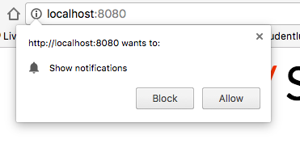
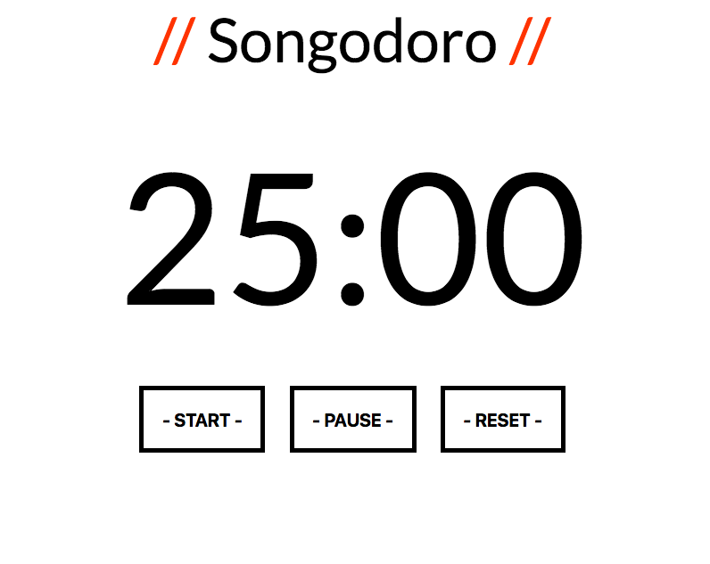
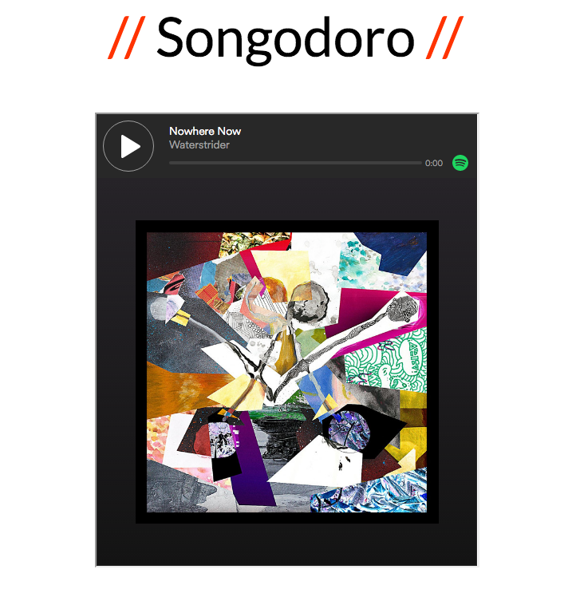

# SONGODORO

*   Version: 1.0
*   Configuration: Run `npm install`
*   Test suite: Run `npm test`
*   Local server: Run `npm start`

## Description

A project built on the concept of the 'pomodoro' working technique, which plays a random track at a break interval every 25 minutes.

Users must have spotify open on their computers for the full track to play.

## Installation

1. Clone this repo.
2. To configure, run: `npm install`
3. Start local server: `npm start`

Testing suite can be found through `npm test`

## Using Songodoro

Songodoro's default port is 8080 on the local host.

Start local server, and navigate to http://localhost:8080/.

Allow notifications:

Songodoro will begin countdown from 25:00. User can revert back to 25:00 at any point by pressing reset.

When countdown has finished, a notification will pop up informing the user that the break has begun.

Upon which, a spotify track will render onto the page, and the user will need to press play to hear the music.

After the track has ended, the user will be informed with a new notification.

The timer will reappear. User can repeat the Songodoro process by pressing start.
